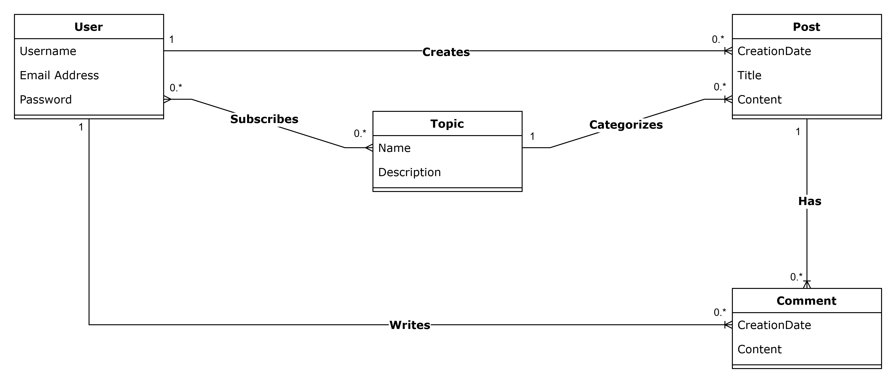

# MDD (Monde De Dev)

## 📝Description

MDD (Dev World) is a full-stack platform designed to provide programming enthusiasts with a friendly space where they can:

- Manage their **subscriptions** to topics that match their interests.
- Access a personalized **newsfeed** full of relevant content.
- **Contribute** by writing new articles and sharing comments.
- **Customize** their user profile and update their information with ease.

The entire application is accessible from **responsive** (mobile and desktop) interfaces and interactions are secured by **JWT tokens** ensuring data protection.

**Technologies used :**

- **Backend**: Spring Boot, Spring Security (JWT), Spring Data JPA (Hibernate), MapStruct, Lombok, MySQL.
- **Frontend**: Angular, PrimeNG, RxJS, jwt-decode.

**Database schema :**


---

## 🚀Installation

### 1️⃣ Cloning the project

```bash
git clone https://github.com/maximedrouault/mdd.git
cd mdd
```

### 2️⃣ Prerequisites

- **Java 21** : [Download Java 21](https://adoptium.net/releases.html)
- **Maven 3.9.9** : [Download Maven](https://maven.apache.org/download.cgi)
- **Node.js 22** : [Download Node.js](https://nodejs.org/en/download/)
- **Angular CLI 19** : install via npm - `npm install -g @angular/cli@19`
- **MySQL 8+** : [Download MySQL](https://dev.mysql.com/downloads/mysql/)

### 3️⃣ Database Configuration

1. Start MySQL and create the database :

   ```
   CREATE DATABASE mdd;
   ```

2. Update the connection details in `back/src/main/resources/application.yaml` :

   ```
   spring:
     datasource:
       url: jdbc:mysql://localhost:3306/mdd?serverTimezone=UTC
       username: YOUR_DB_USER # Update according to your configuration
       password: YOUR_DB_PASSWORD # Update according to your configuration
   ```

### 4️⃣ Installing and starting the backend

1. Navigate to the backend directory :
   ```bash
   cd back
   ```
2. Build and run the project with Maven :
   ```bash
   mvn spring-boot:run
   ```
3. The backend will be accessible at **[http://localhost:9000](http://localhost:9000)**

### 5️⃣ Installing and starting the frontend

1. Navigate to the frontend directory :
   ```bash
   cd front
   ```
2. Install npm dependencies :
   ```bash
   npm install
   ```
3. Start the Angular application :
   ```bash
   npm start
   ```
4. The frontend will be accessible at **[http://localhost:4200](http://localhost:4200)**

### 6️⃣ Loading Initial Data

The database schema is automatically created by Spring at startup; you can then load the initial data :
```
mysql --default-character-set=utf8mb4 -u YOUR_DB_USER -p mdd < back/src/main/resources/data.sql
```

---

### 📌Authentication

The application uses JWT to secure requests.

**Test accounts** (password for all: `Password123!`) :

- John Doe (`john.doe@example.com`)
- Jane Smith (`jane.smith@example.com`)
- Alice Johnson (`alice.johnson@example.com`)
- Bob Brown (`bob.brown@example.com`)
- Charlie Green (`charlie.green@example.com`)

### 📌Key Features

- **Topic Management**: subscribe and unsubscribe to topics, discover new themes.
- **Personalized Newsfeed**: display articles from subscriptions with chronological sorting (ascending/descending).
- **Article Creation**: write and publish articles associated with a chosen topic.
- **Adding Comments**: engage in discussions by commenting on articles.
- **User Profile Update**: modify email, username, and password.
- **Responsive Interface**: optimized user experience on both mobile and desktop.

### 📌Postman Collection

For testing the API endpoints, you can use Postman collection in `back/docs/mdd.postman_collection.json`.
This collection includes all the endpoints with example requests.
`